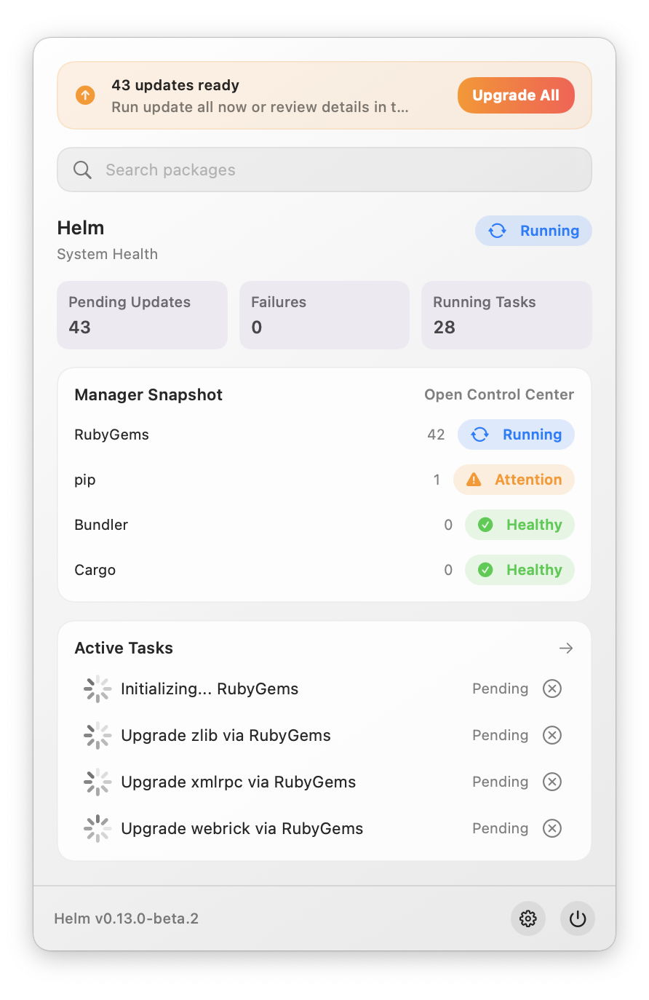
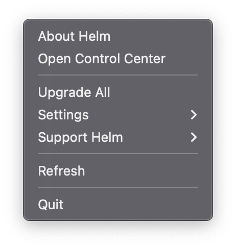
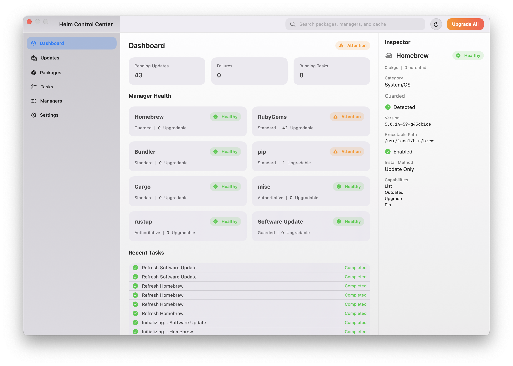
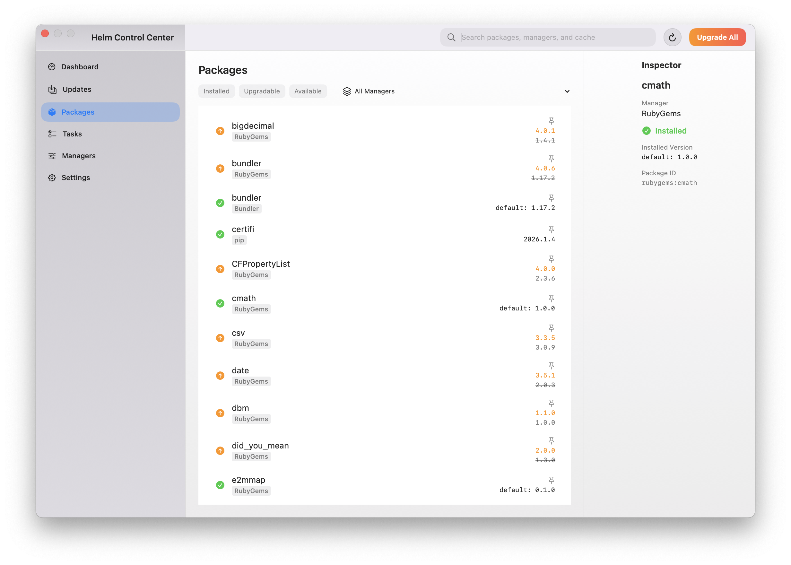
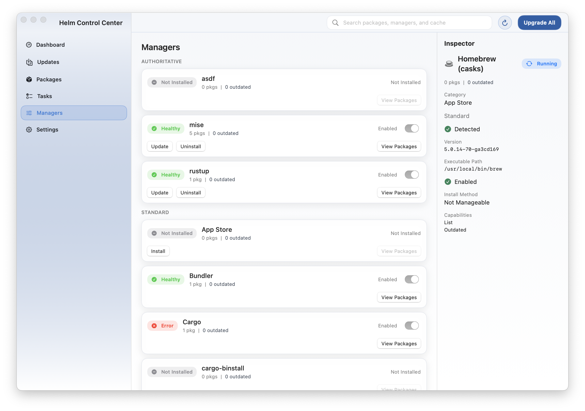
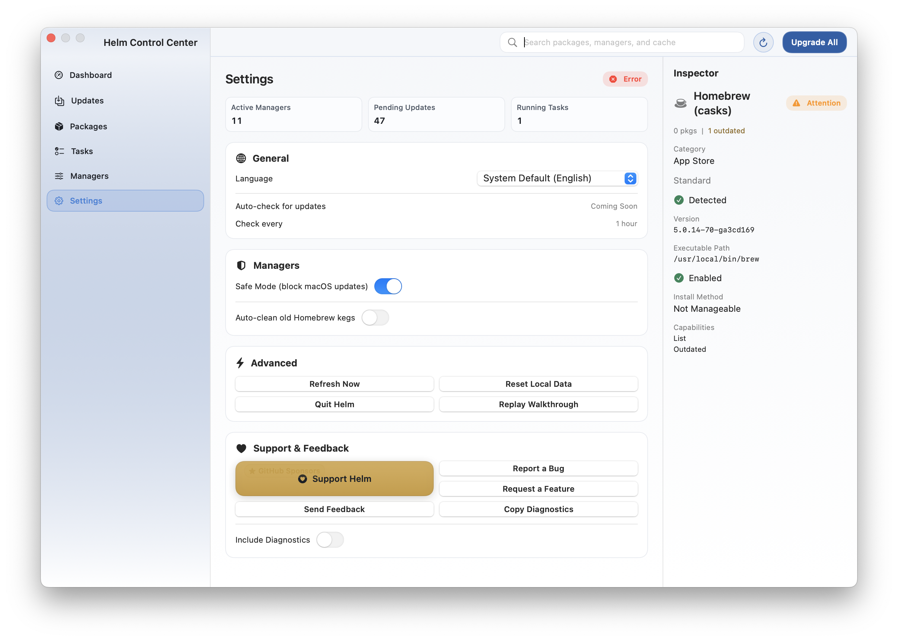
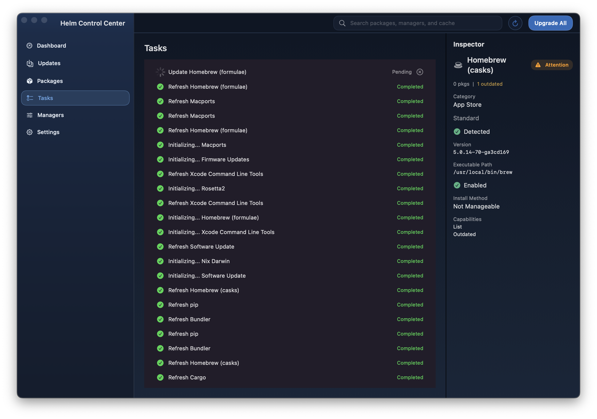
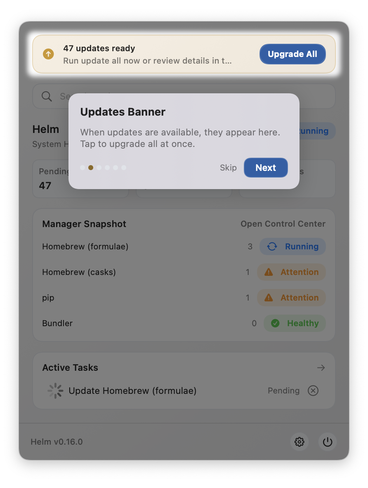

# Native macOS Current-Experience Audit

Status: v0.18 planning evidence, not a production redesign
Implementation baseline: `origin/dev` at `278ae026` (2026-08-04)
Audit date: 2026-08-04

## Purpose and Evidence

This audit distinguishes four categories:

- **Observed**: confirmed in the current SwiftUI/AppKit source or repository capture.
- **Defect**: behavior that breaks a user task, platform expectation, accessibility requirement, or truthful state model.
- **Design debt**: functional behavior whose custom structure makes future quality or consistency harder.
- **Direction**: a v0.19-v0.22 proposal that is not implemented in v0.18.

Evidence sources:

- App/window integration: `apps/macos-ui/Helm/AppDelegate.swift`, `AppDelegate+Windows.swift`, and `HelmApp.swift`.
- Popover: `Views/DashboardView.swift`, `PopoverHelpers.swift`, and `PopoverOverlayViews.swift`.
- Control Center: `Views/ControlCenterViews.swift`, `ControlCenterSectionViews.swift`, `PackageListView.swift`, `TaskListView.swift`, `ManagersView.swift`, `SettingsPopoverView.swift`, and `InspectorViews.swift`.
- First run: `Views/Onboarding/Onboarding*.swift` and `Views/Walkthrough/*`.
- Current design reference: `docs/ui/SWIFTUI_ARCHITECTURE.md`.
- Repository captures: `web/src/assets/tour/`, committed 2026-02-20 at `31c0ca06`. These captures show the integrated design lineage but visibly identify Helm v0.16 in places. They are representative visual evidence, not proof of every v0.18.1 state. Current behavior claims below are source-verified separately.
- Apple guidance reviewed 2026-08-04: [Designing for macOS](https://developer.apple.com/design/human-interface-guidelines/designing-for-macos), [Windows](https://developer.apple.com/design/human-interface-guidelines/windows), [Toolbars](https://developer.apple.com/design/human-interface-guidelines/toolbars), [Sidebars](https://developer.apple.com/design/human-interface-guidelines/sidebars), [Menus](https://developer.apple.com/design/human-interface-guidelines/menus), [Settings](https://developer.apple.com/design/human-interface-guidelines/settings), [Focus and selection](https://developer.apple.com/design/human-interface-guidelines/focus-and-selection), [Accessibility](https://developer.apple.com/design/human-interface-guidelines/accessibility), [Popovers](https://developer.apple.com/design/human-interface-guidelines/popovers), and [Scroll views](https://developer.apple.com/design/human-interface-guidelines/scroll-views).

No app was launched for this audit. This avoided the stable user database and was unnecessary because current source plus existing captures covered the planning questions. Any later runtime capture must use a development build and an explicit temporary `HELM_DB_PATH`.

## Representative Captures

### Menu bar popover

The capture shows the current card-heavy hierarchy: attention banner, custom search field, health heading, three metric chips, manager snapshot card, task card, and custom footer controls.

### Right-click status menu

The menu uses native `NSMenu` presentation, but command organization and keyboard equivalents remain incomplete.

### Control Center overview and inspector

The three-region model is visible, but the titlebar, toolbar, sidebar, content cards, and inspector are custom SwiftUI composition inside a fixed-size window.

### Packages

The dense package content is effective, but selection, filters, row actions, and manager choice do not use one native list/table model.

### Managers

Manager source and enablement are visible. Large cards and pointer drag handles make comparison and keyboard reordering difficult.

### Settings

Settings currently mixes preferences, health, support, refresh, reset, quit, walkthrough replay, and diagnostics in the operational window.

### Tasks in dark appearance

Dark mode is explicitly tokenized. The capture also shows inactive-looking window controls with saturated custom content, an example of why inactive-window behavior needs deliberate validation.

### Mandatory walkthrough

The spotlight tour overlays and blurs the real interface after setup. Project WOW replaces this with value-first, optional contextual guidance.

## Executive Findings

| Severity | Finding | Classification | Evidence | Approved direction |
|---|---|---|---|---|
| Critical | Full keyboard traversal is not complete; custom rows and tap gestures do not form a reliable AppKit key-view and arrow-navigation model. | Defect | `SWIFTUI_ARCHITECTURE.md`; custom `ScrollView`/`Button`/`onTapGesture` composition | Native source lists/tables plus a bounded AppKit focus bridge in v0.19-v0.21. |
| High | Control Center is fixed to exactly `1120x740`; minimize and zoom are disabled, no frame restoration is configured, and full-screen is unavailable. | Defect | `AppDelegate.swift` sets equal `minSize`/`maxSize` and disables standard buttons | Resizable/restorable window with a tested minimum, adaptive inspector, and standard window state. |
| High | The visual top bar is not an `NSToolbar`/SwiftUI toolbar, so system overflow, customization, inactive appearance, and command parity are absent. | Design debt | `ControlCenterTopBar` in `ControlCenterViews.swift` | Frame-hosted toolbar with sidebar toggle, search, refresh, inspector toggle, and one primary contextual action. |
| High | Settings is a sixth operational section and quick-settings overlay, while the actual SwiftUI `Settings` scene is empty. | Defect | `HelmApp.swift`; `SettingsPopoverView.swift`; status submenu | Dedicated Settings scene/window, App-menu item, and Command-Comma. Move operational actions to Control Center. |
| High | Offline, cached freshness, partial coverage, interrupted workflow, failed verification, and honest rollback limits are not represented consistently across surfaces. | Defect | View-state scan finds only connection, generic failures, loading, and terminal task labels | Adopt the shared state matrix and Project WOW contracts before implementing first run. |
| High | Current first run is a five-step configuration wizard followed by 13 spotlight steps, before personalized value is demonstrated. | Defect | `OnboardingContainerView.swift`; `WalkthroughState.swift` | License gate if required, streaming Environment Brief, reviewed plan, verified improvement, receipt, optional contextual tips. |
| Medium | Custom cards, pills, circular icon buttons, hover cursor forcing, gradients, and overlays replace standard Mac structures. | Design debt | `HelmButtonStyles.swift` and most section views | Use native semantics first; retain brand primarily in accent, status illustrations, and receipts. |
| Medium | Diagnostics is split between a task popover, manager inspector, Settings service-health card, support exports, and failure actions. | Design debt | `InspectorViews.swift`; `SettingsPopoverView.swift` | Contextual diagnostics in Activity/Sources, with one support export command; configuration only in Settings. |
| Medium | Selection is local color overlay on card/tap targets and is cleared on many section changes; inactive selection and multi-selection behavior are undefined. | Defect | `ControlCenterContext.alignInspectorSelection`; card overlays | Native persistent selection per destination, inactive selection appearance, and explicit deep-link selection restoration. |
| Medium | Search mutates navigation to Packages as text changes, and popover search opens a custom overlay. Remote progress is only a spinner. | Design debt | `ControlCenterTopBar`; `PopoverSearchOverlayContent` | Search field is a command surface; results disclose local/cached versus remote/deferred scope and preserve origin on cancellation. |
| Medium | Increased Contrast and Reduce Transparency have no explicit design behavior. Reduce Motion is only partially observed. | Defect | source has `accessibilityReduceMotion`, but no contrast/transparency/inactive state handling | System materials/colors where possible and explicit fallback matrix in v0.21. |
| Low | `SettingsSectionView` currently renders the CLI integration card twice. | Observed defect | Duplicate `SettingsCard` blocks in `SettingsPopoverView.swift` | Remove during v0.19 Settings migration; do not patch in planning-only v0.18. |

## Surface Audit

### Menu bar icon

Observed:

- `NSStatusItem` uses a custom anchor asset or SF Symbol fallback.
- Priority is failure `!`, then update count capped at 99, then running dot, then no badge.
- Tooltip and accessibility label are localized and state-specific.
- Both click types use the shared popover rather than a separate `NSMenu`.
- A visible Dashboard receives focus on primary status-item click, while secondary click keeps the popover available alongside it.

Defects and debt:

- The colored count/symbol/dot is manually drawn at very small sizes and needs increased-contrast, Differentiate Without Color, display-scale, and crowded-menu-bar validation.
- Update count can dominate an urgent running approval state because only one badge channel exists and timeout approval is notification-only.
- No explicit stale/cached/offline badge semantic exists.

Direction:

- Retain one quiet template icon. Use a dot or symbol only for the highest-priority condition; expose counts in accessible title/popover, not as the only meaning.
- Priority contract: approval required or failed > interrupted > updates ready > active work > healthy/cached > offline stale.
- Keep right-click commands semantically identical to application-menu commands.

### Right-click menu

Observed:

- Native `NSMenu` contains About, Check for Updates, Open Control Center, Upgrade All, Settings submenu, Support submenu, Refresh, and Quit.
- Items are explicitly enabled from onboarding, updater, refresh, and update state.

Defects and debt:

- Every `keyEquivalent` is empty.
- Settings is split into quick and advanced forms rather than the standard Settings command.
- Support payment channels occupy a top-level status-menu submenu while core operational commands lack a normal app menu.
- The menu has no selection/context commands, Window commands, Help entry, or diagnostics deep link.

Direction:

- Status menu: Open Helm, Review Attention, Pause/Resume or Stop current work when applicable, Refresh, Settings..., Help, Quit.
- Standard application menus own About, Settings..., Hide, Quit, Edit commands, View sidebar/inspector commands, Window behavior, and Help.

### Popover

Observed:

- Borderless nonactivating `NSPanel`, 400 pt wide and 520-740 pt measured height.
- It can become key/main, joins all Spaces, remains visible on deactivate, and dismisses on outside click.
- Content includes conditional attention banner, search, health, metrics, four managers, four tasks, Settings/About/Quit overlays, and upgrade sheet.
- Cached structures are displayed from shared published state and refresh triggers on appearance.
- Escape closes overlay then panel; Command-F opens search.

Defects and debt:

- The panel has no popover arrow and is positioned manually; screen-edge/multi-display clamping is not visible in source.
- It duplicates Control Center metrics, manager list, task expansion, package quick actions, settings, About, and quit confirmation.
- Layered custom overlays blur and disable the base instead of using a bounded native popover, menu, alert, or separate window.
- Search and task expansion make the ambient surface vertically unstable.
- `hidesOnDeactivate = false` plus manual global event monitoring requires careful activation/accessibility testing.

Direction:

- One condition sentence, last-updated/freshness line, one primary action, up to three active/recent work rows, and Open Helm.
- Search, package mutation, Settings, diagnostics, and long task output move to Control Center or standard windows.
- Preserve immediate cached render and deterministic dismissal/focus restoration to the status item.

### Control Center shell, titlebar, navigation, toolbar, inspector

Observed:

- Custom `NSWindow` has `.titled`, `.closable`, `.miniaturizable`, `.resizable`, and `.fullSizeContentView`, but behavior then disables minimize/zoom and fixes both dimensions.
- Title is hidden; titlebar is transparent; custom top bar starts beneath the traffic lights.
- Sidebar is a 232 pt `ScrollView` of custom buttons.
- Main and inspector use `HSplitView`; inspector is always present at 260-320 pt.
- Global search, Refresh, and Upgrade All live in the custom top bar.
- Background dragging is enabled across the window except around manager drag operations.

Defects and debt:

- Declared resizability is contradicted by equal min/max size.
- No show/hide sidebar or inspector command, toolbar overflow, autosave name, restoration, minimize, zoom, or full-screen policy.
- Whole-window background dragging competes with custom controls and reorder gestures.
- Inspector can show a stale manager while Overview or Settings is visible in older captures; current section alignment clears some selections but also loses context.
- No inactive-window-specific treatment exists for custom accent fills.

Direction:

- Native split-view hierarchy, source-list sidebar, frame toolbar, contextual inspector, window autosave/restoration, and standard activation.
- Minimum target `860x600`; expanded reference `1280x800`. Below inspector threshold, hide inspector and preserve selection for restoration.
- Keep one contextual primary action; every toolbar command has a menu equivalent.

### Overview / Health

Observed:

- Three metric cards, adaptive manager card grid, health badges, and recent task card.
- Metric cards deep-link to Updates, Overview, or Tasks.
- Manager card tap selects inspector without navigating to Managers.

Defects and debt:

- Healthy and error states receive similar card weight; the page behaves like a dashboard rather than a prioritized health queue.
- Failure count routes back to Overview instead of selecting the first actionable failure.
- No scan coverage, freshness, offline, or partial-result summary.
- Card grid is inefficient for 20+ implemented managers.

Direction:

- Rename to Health. Lead with current condition and required action, then findings grouped by severity/authority, then coverage/freshness.
- Healthy state collapses to a short summary; sources remain available through Sources.

### Updates

Observed:

- Authority stages, manager/package scope, package filtering, OS toggle, risk flags, projected status, failure groups, retry, cancellation, and run controls are present.
- Upgrade sequencing remains backend-owned.

Defects and debt:

- Initial plan refresh has no dedicated loading/error state; empty uses the generic no-recent-tasks copy.
- The page can run a plan directly while a separate upgrade sheet offers a much thinner summary, producing two preview models.
- Risk flags are passive rows and do not distinguish policy, privilege, network, restart, or rollback limits.
- Only 80 plan steps render, without an explicit truncation notice.

Direction:

- One reviewed-plan model: table/outline of authority stages, status column, consequence summary, and selection inspector.
- Use a sheet only for final bounded confirmation after review, not as an alternate preview.

### Packages and search

Observed:

- Local/cached/search results are consolidated; status chips, horizontal filters, manager menu, lazy rows, inspector, and package action buttons are available.
- Remote search progress is a small spinner; package install may open a radio-group sheet.

Defects and debt:

- `ScrollView` rows with `onTapGesture` do not provide native list selection, arrows, type selection, context menus, sorting, columns, or inactive selection.
- Primary icon action can vary by row without a visible text label.
- Search automatically changes the selected section while typing.
- No explicit cached/local/remote result grouping, freshness, offline deferred state, or remote cancellation affordance.

Direction:

- Native `Table`/AppKit table fallback with stable selection, sortable Name/Manager/Installed/Available/Status columns, context menu, and inspector actions.
- Search results identify Local, Cached, and Remote enrichment; offline remote work is Deferred, not Failed.

### Tasks / Activity and diagnostics

Observed:

- Queued/running/completed/failed/cancelled task rows, cancel and failed-dismiss actions, inline command/output, selection inspector, task diagnostics popover, logs, filters, and pagination exist.
- Failed tasks persist until explicitly resolved/dismissed by current policy.

Defects and debt:

- Tasks mixes ephemeral queue state with durable history but offers no grouping, time filter, receipt relationship, interruption category, or verified outcome.
- Diagnostics uses a large `popover` from a narrow inspector and embeds a tabbed mini-application.
- Completed rows can overwhelm the list; the current capture shows low signal density.

Direction:

- Rename to Activity. Group Active, Needs Attention, and History. Represent workflow/session, verification, and receipt relationships.
- Diagnostics is a selected Activity detail or dedicated window, not a nested inspector popover.

### Managers / Sources

Observed:

- Authority grouping, health, package/outdated counts, enablement, policy reasons, operation progress, package/install/detect actions, drag reordering, dependency alerts, provenance, install instances, repair, install, update, uninstall, and post-install setup are available.

Defects and debt:

- Large cards make comparison difficult and place selection, drag, toggle, and actions in one hit region.
- Drag reorder is pointer-only; no keyboard/menu equivalent is defined.
- The manager inspector exceeds 4,000 lines of source and acts as an unstructured second application with multiple sheets and alerts.
- Policy-blocked and permission-blocked presentation is not consistently separated outside specific messages.

Direction:

- Rename to Sources. Use a source-list/table with status, authority, provenance summary, enabled state, and selected inspector.
- Put install/update/uninstall in contextual commands; use bounded sheets for install and destructive confirmation. Keep policy evaluation in core.

### Settings and diagnostics

Observed:

- General preferences, launch at login, language, safe mode, Homebrew cleanup, CLI integration, service health, support, diagnostics copy, refresh, reset, quit, walkthrough replay, and manager priority reset share one scrolling section.
- The actual `Settings` scene is `EmptyView`.
- The CLI integration card is duplicated in current source.

Defects and debt:

- Operational work and app lifecycle commands are misplaced in Settings.
- No Command-Comma route or standard Settings window.
- Health metrics deep-link out of a surface that should be preference-only.
- Fixed card/grid layout is vulnerable to localization expansion.

Direction:

- Settings panes: General, Updates, Sources, CLI, Support. Durable preference and diagnostic-export configuration only.
- Refresh, reset local data, service status, repair, diagnostics inspection, quit, and walkthrough/help actions move to Control Center or standard menus.

### Current onboarding and proposed Project WOW first run

Observed current flow:

- Welcome -> optional license -> detection -> manager enable/disable -> settings -> 6-step popover walkthrough -> 7-step Control Center walkthrough.
- Detection is local and detection-only; found managers stream while version probing continues.
- Progress dots expose step count; main controls are custom primary buttons.

Defects and debt:

- Users configure managers and settings before seeing a meaningful personalized result.
- No persistent `Local scan / No changes / No network` trust statement.
- Detection has no cancel, partial-coverage explanation, per-manager retry, or service-unavailable recovery.
- Mandatory spotlight guidance obscures content and creates focus/VoiceOver complexity.

Direction:

- Present the real app shell, legal sheet only when required, then Environment Brief with progressive findings.
- Offer Use Helm Now, Review Plan, and Customize after value appears.
- Plan -> approved typed action -> verification -> Action Receipt remains continuous and resumable.

## Input, Window, and Lifecycle Audit

| Area | Current behavior | Defect/debt | Target requirement |
|---|---|---|---|
| Selection | Custom fills and tap gestures; one selection ID per entity type | No native inactive selection, arrow navigation, range selection, or type selection | Native single selection initially; arrows within list/table; selection survives refresh and section return. |
| Focus | Command-F and Escape are intercepted at window level; some sheets use default/cancel shortcuts | Tab loop remains incomplete; focus order and restoration are undefined | Full Keyboard Access traversal with documented groups; restore trigger/list/inspector focus after dismissals. |
| Keyboard | Command-F/W plus text editing; no status-menu equivalents | No app command model, destination shortcuts, sidebar/inspector toggles, or reorder alternatives | App/Edit/View/Window/Help menus and conventional shortcuts; no pointer-only release-critical command. |
| Pointer | Custom `onHover` changes arrow to pointing hand for many Mac controls | Cursor forcing is nonstandard and hover can become required to discover icon actions | System hover/cursor behavior; tooltips supplement visible/menu commands. |
| Activation | Panel activates app; Control Center click suppresses panel | Needs VoiceOver, Spaces, multi-display, and status-item focus-return validation | One key surface; deterministic status-item/panel/window activation and dismissal. |
| Resize | Window fixed at `1120x740` | Direct platform mismatch and no minimum/expanded prototypes | Resizable from `860x600`; adaptive columns; preserve divider positions. |
| Restoration | Controller retained while app lives; no autosave/restoration | Position, size, section, pane visibility, selection, filters, and scroll are not durable | Restore safe window frame/display, destination, pane visibility/width, selection, filters, and scroll anchor. |
| Multi-display | Panel manually centered under status item | No visible screen-edge clamp or display-change handling | Clamp popover to visible frame; restore Control Center to an available display. |

## State Coverage Audit

| State | Current evidence | Gap |
|---|---|---|
| Loading | Spinners for refresh, search, detection, manager operation, descriptions, diagnostics | No consistent first-useful-versus-complete label or skeleton/stable geometry policy. |
| Healthy | Health badge and zero counts | Healthy pages retain dashboard/card weight instead of receding. |
| Empty/not applicable | Basic text in packages, tasks, managers, manager snapshot | Copy and next actions are inconsistent; Updates reuses task-empty copy. |
| Partial data/failure | Per-manager health and failure groups | No global coverage statement, stale subset, or exact failed/deferred scope. |
| Policy blocked | Eligibility reason and managed install-method tags | Not a shared visual/content semantic; can be confused with disabled or permissions. |
| Permission blocked | Task failure/privilege confirmation paths | No consistent permission-specific state with retry after authorization. |
| Offline/deferred | Connection banner only | Offline and remote-deferred work are not modeled distinctly. |
| Queued/running | Task rows, manager operation state, progress indicators | No workflow-level phase/progress continuity in all surfaces. |
| Cancelled/interrupted | Task terminal status supports cancelled | Interrupted/resumable is absent; cancellation consequence is not summarized. |
| Verified completion | Some manager install and adapter flows re-detect | UI mostly says Completed; verified outcome and before/after are not first-class. |
| Failed verification | Can surface as generic failure | Must distinguish action failure from action succeeded but verification failed. |
| Recovery/rollback | Retry groups, repairs, diagnostics, reset | No shared recovery context, persisted setup session, receipt, or honest rollback limits. |

The complete target semantics are in `NATIVE_MACOS_STATE_MATRIX.md`.

## Appearance Audit

| Appearance | Current behavior | Required change |
|---|---|---|
| Light | Custom dynamic Helm tokens and gradients | Retain restrained brand accent; use system backgrounds/selection where behavior matters. |
| Dark | Explicit navy panel hierarchy and custom status colors | Validate text, dividers, disabled controls, output panes, and semantic colors without relying on brand-only contrast. |
| Inactive window | No `controlActiveState` or equivalent custom-state adaptation found | System lists/toolbars first; custom receipts/status views must visibly subdue without losing legibility. |
| Increased Contrast | No explicit handling found | Strengthen boundaries/focus/status through system colors or contrast-aware variants; zero color-only status. |
| Reduced Motion | Some button/overlay/spotlight transitions adapt | Remove spring/blur/scale where unnecessary; every remaining transition has no-motion equivalent. |
| Reduced Transparency | No explicit handling found; popover uses `NSVisualEffectView` | Use opaque semantic fallback and remove blur-dependent hierarchy. |
| Differentiate Without Color | Icons/text usually accompany status, but not comprehensively tested | Treat icon + state word + position as required; badge and focus cannot rely on hue. |

## Approved Audit Conclusions

1. Retain the dual-surface model, but make the popover materially smaller in responsibility.
2. Replace the six-section structure with the approved job-first IA in `NATIVE_MACOS_INFORMATION_ARCHITECTURE.md`.
3. Build the Control Center from native window, toolbar, source-list, split-view, table/list, and inspector semantics before visual polish.
4. Move Settings out of operational navigation and move diagnostics out of Settings.
5. Treat keyboard traversal, state continuity, inactive appearance, contrast, motion/transparency preferences, and performance budgets as implementation gates.
6. Replace configuration-first onboarding and mandatory spotlight tours with the Project WOW value loop.
7. Preserve service/core ownership of policy, planning, orchestration, verification, persistence, and recovery truth.
