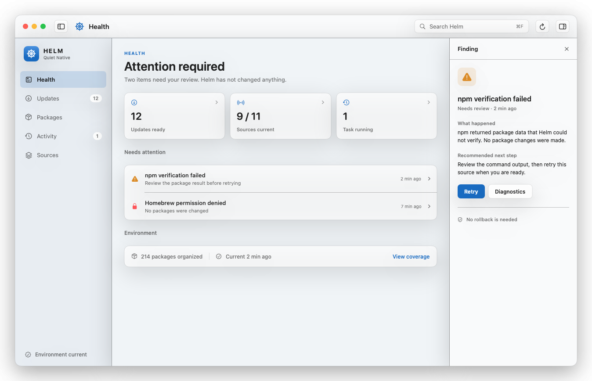
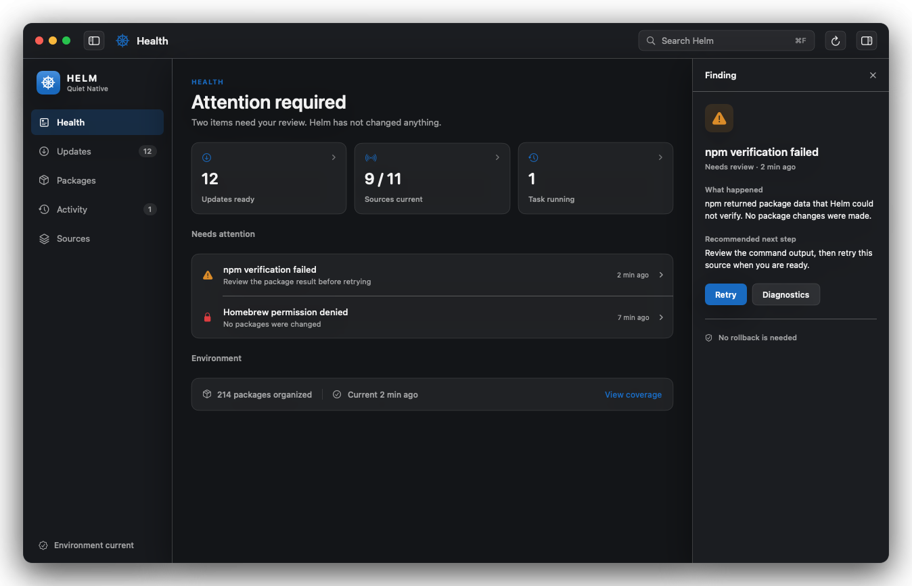
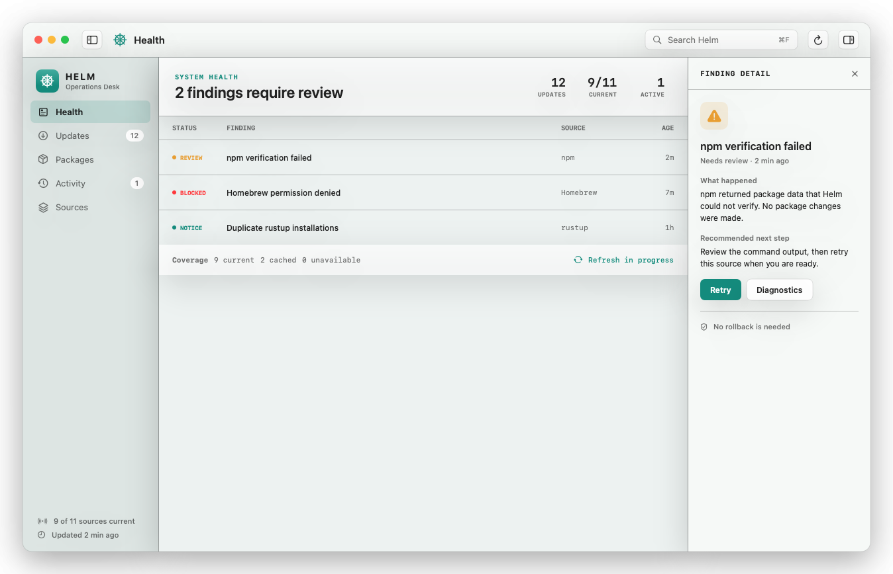
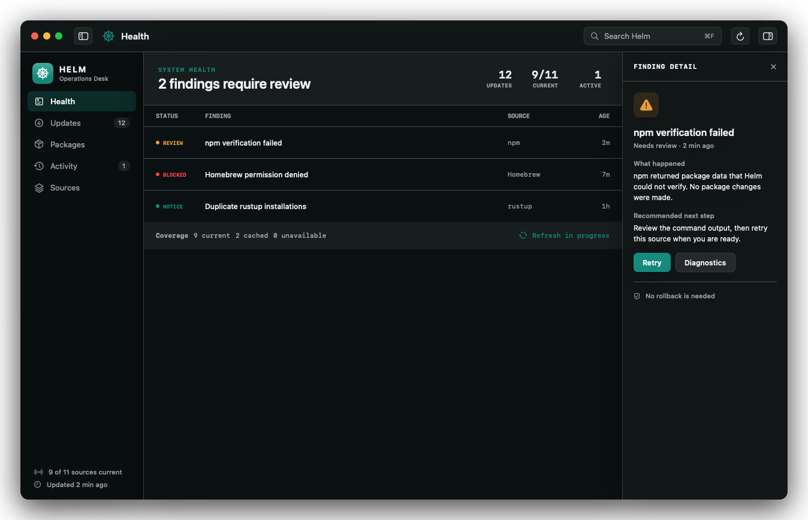
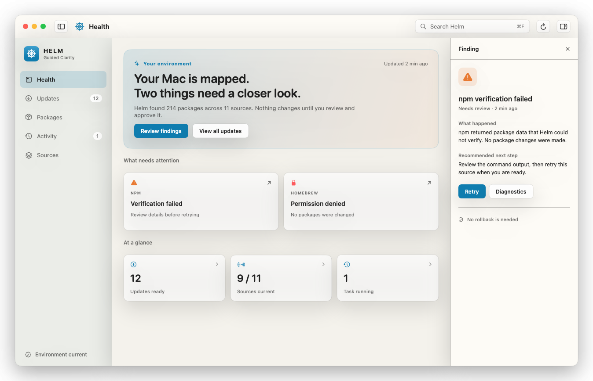
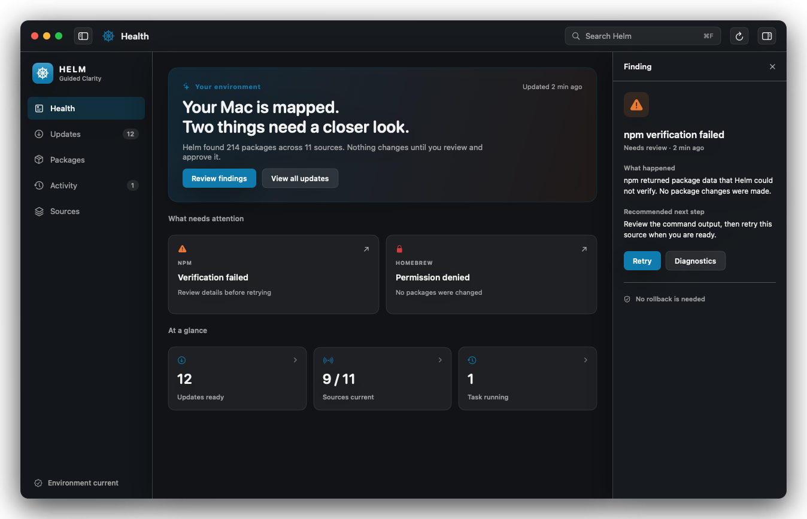

# v0.19 Visual Direction Proposals

Status: **Round 1 proposed; awaiting product-owner review**

Decision owner: project owner

Implementation effect: none until a direction is explicitly approved

## Decision to make

Choose the visual character that should anchor Helm's native Control Center before production sidebar, split-view, and component styling work begins. The information architecture and sample state are held constant so this review is about visual hierarchy, density, materials, and product character rather than feature scope.

This decision does not block Slice 19.1 command/window plumbing. It blocks visual styling decisions in Slices 19.2 and 19.4.

## Direction A: Quiet Native

Calm and restrained, with familiar macOS spacing, light materials, and sparse Helm color. This direction minimizes novelty and should age well, but it risks feeling less distinct from other high-quality Mac utilities.

## Direction B: Operations Desk

Compact and precise, with a stronger data hierarchy, monospaced operational labels, and higher information density. This direction rewards frequent expert use, but it may feel less welcoming during first run.

## Direction C: Guided Clarity

Warmer and more explanatory, with a confident summary, progressive guidance, and a clearer trust statement. This direction supports Project WOW and novice confidence, but it uses more space and must avoid becoming a dashboard of decorative cards.

## Review questions

Please respond in the PR with direct answers or inline comments on the renders:

1. Which direction should be the foundation: A, B, C, or a clearly described combination?
2. Does the information density feel too sparse, balanced, or too compressed?
3. Should Helm's identity be quieter or more visible than shown?
4. Which direction communicates operational safety and trust most clearly?
5. What is the first element you would remove or change in the preferred direction?

## Decision log

| Date | Direction | Decision | Reason | Follow-up |
|---|---|---|---|---|
| Pending | A: Quiet Native | Proposed | Initial comparison | Owner review |
| Pending | B: Operations Desk | Proposed | Initial comparison | Owner review |
| Pending | C: Guided Clarity | Proposed | Initial comparison | Owner review |

After a direction is approved, Round 2 will render only that direction at `860x600` and `1280x800`, in light/dark and key/inactive states. Production implementation begins only after the selected direction passes that focused review.

## Guardrails

- These are code-rendered planning artifacts, not production SwiftUI.
- All directions use the approved Health/Updates/Packages/Activity/Sources information architecture.
- Fixture content is synthetic and does not define core behavior or policy.
- Native controls, semantic colors, keyboard behavior, accessibility, localization expansion, Reduce Transparency, and Increased Contrast remain implementation requirements.
- Helm Blue is an accent. Warnings and failures retain semantic meaning and are never encoded by brand color alone.
