# v0.19 Experience Direction Proposal

Status: **Approved: Original Wayfinder**

Decision owner: project owner

Implementation effect: approved implementation input for the incremental v0.19-v0.22 migration

Implementation checkpoint: the first production foundation is active on `dev`. Dashboard, popover, and status item consume one revisioned Wayfinder priority/deep-link projection; backend-owned determinate progress is validated rather than inferred; and the legacy content host now runs in a restored, resizable window presented as Dashboard. This checkpoint does not yet claim the Original Wayfinder visual composition, native workspace sidebar, rendered Course Indicator, or two-interface cleanup is complete.

## Why Round 1 was reset

The owner preferred Round 1 Direction A's calm native tone, but correctly found that all three directions were skins over substantially the same sidebar/content/inspector shell Helm already has. Round 1 is rejected as an experience direction.

Round 2 starts from Helm's purpose and six release-critical jobs rather than its current views. Iteration 1 established the Navigator thesis. Iteration 2 tested that thesis through three genuinely different compositions. Owner feedback favored Wayfinder, so iteration 3 narrows the active decision to the original and two restrained refinements.

## Product thesis: Helm is an environment navigator

Helm should not feel like a package-manager dashboard or a grid of manager status cards. It should feel like a calm, trustworthy navigator for the Mac's whole software environment.

At every entry point, Helm should answer three questions in order:

1. **Am I on course?** State one dominant truth about the environment.
2. **What needs me?** Separate attention, approval, and active work from background detail.
3. **What is the safest next move?** Offer one clear action backed by Helm's authority ordering and verification model.

The product character is **quiet confidence**: professional and macOS-native, but recognizable through Helm's compass/route language rather than custom control chrome or a loud theme.

## What the references teach us

| Reference | Keep | Avoid |
|---|---|---|
| Docker Dashboard | Restraint, clear search, simple workspace navigation | Empty utility shell, oversized branded chrome, visually generic content |
| Avast | One dominant state, immediate recognition, confident composition | Promotional tile grid, visual theater, non-native controls, fear-driven messaging |
| macOS System Settings | Native translucent sidebar, platform spacing, familiar selection and toolbar behavior | High destination density and settings-like taxonomy for operational work |
| Docker menu | Fast command access, predictable menu semantics, direct Dashboard route | Too little product value and no meaningful active-work context |
| Parallels Toolbox | Dashboard/Library distinction and visual discoverability | Launcher grid, cartoon icon dependence, treating unlike actions as equal tiles |
| Current Helm popover | Real environment state, search route, visible active work | Miniature duplicate of the large window, metric-card density, deep management in a transient surface |

## Two operational interfaces

Helm has exactly two operational interfaces:

1. **Status-item popover** — ambient state, one next action, current work, and fast commands.
2. **Dashboard** — inspection, planning, discovery, execution, history, and recovery.

Left-click and right-click on the status item open the same popover. There is no separate context menu with a second information architecture. Standard macOS application menus, the Settings scene, confirmation sheets, and alerts remain system presentations rather than additional operational interfaces.

## Dashboard architecture

The large window is renamed **Dashboard**. Its default view is not a list with an always-open inspector. It is a responsive environment brief organized around current intent.

Primary workspace:

- **Dashboard** — dominant environment truth, route/coverage, items needing the user, and current work.
- **Plan** — dependency- and authority-ordered updates, exclusions, consequences, confirmation, and verification.
- **Library** — unified apps/tools/packages search and management without requiring manager knowledge first.
- **Activity** — active execution, approvals, history, Action Receipts, failure evidence, and recovery.

**Environment** is contextual infrastructure rather than a fifth peer workflow. It lives persistently at the sidebar foot and opens source/manager coverage, provenance, policy, and repair detail when needed.

Original Wayfinder and this workspace model are now approved. `NATIVE_MACOS_INFORMATION_ARCHITECTURE.md`, `NATIVE_MACOS_EXPERIENCE.md`, and the migration map carry the canonical implementation contract; legacy destination names remain migration aliases only.

## Iteration 3: Wayfinder convergence

Wayfinder is the strongest foundation because it balances macOS familiarity, navigation scale, and Helm identity. This iteration tests only minor changes to hierarchy and density; the information architecture, status semantics, environment route, and two-interface contract remain identical.

| Candidate | Refinement | Strength | Risk |
|---|---|---|---|
| **Original** | The iteration 1 Wayfinder unchanged | Best overall balance and strongest visual presence | Hero may be slightly oversized for routine use |
| **Quieter** | Smaller hero, softer boundaries, unboxed route and findings | Most native, calm, and spacious | Can feel passive and leaves less obvious grouping |
| **Focused** | Compact hero, Plan summary, denser route, explicit row actions | Clearest operational hierarchy | Less distinctive and more dashboard-like |

**Decision:** Original Wayfinder is the production foundation for both Dashboard and popover. Quieter and Focused remain rejected comparison artifacts. A compact Plan-at-a-glance summary may appear contextually when a real actionable plan exists, but it does not replace Original's hero, route, or composition.

### Dashboard: Original

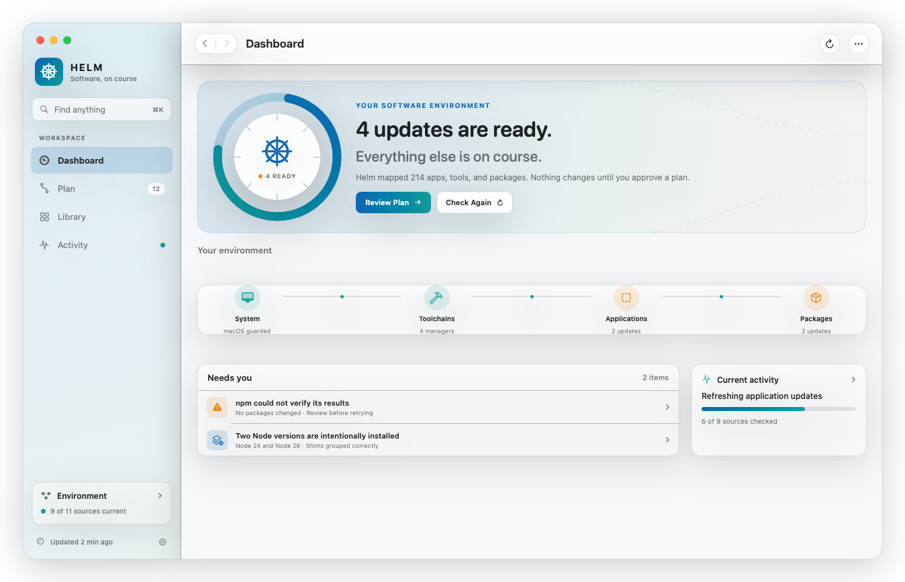

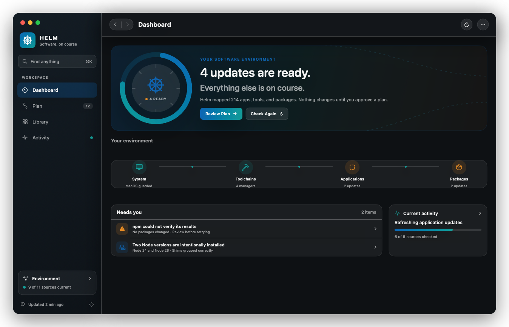

### Dashboard: Quieter

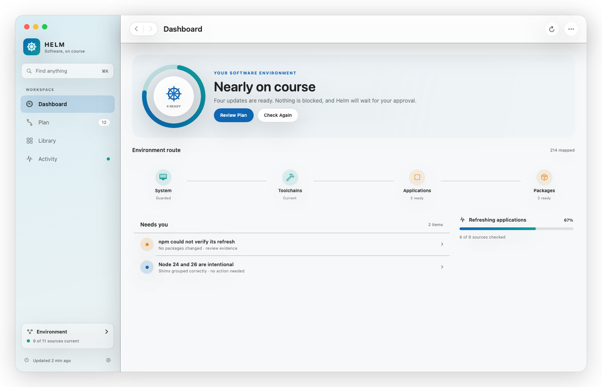

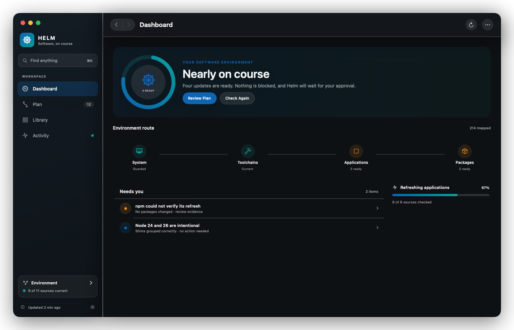

### Dashboard: Focused

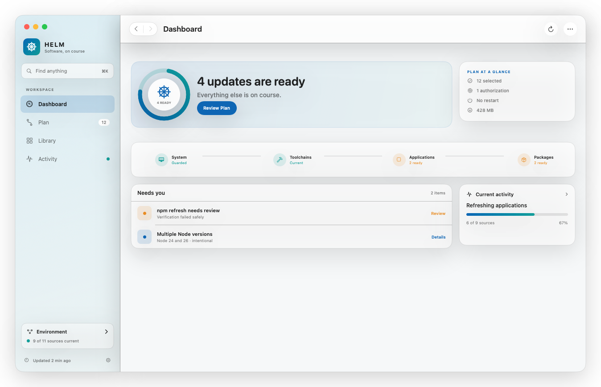

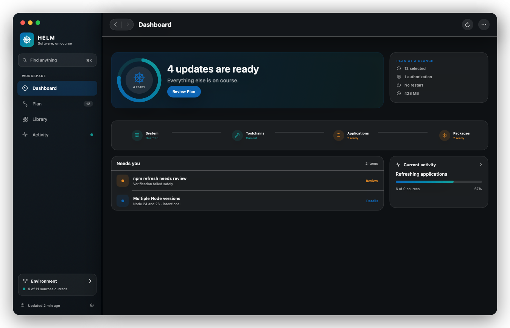

### Popover: Original

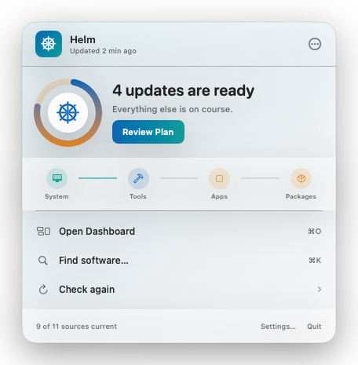

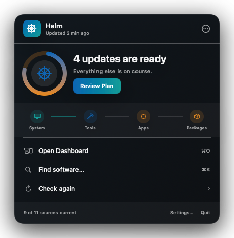

### Popover: Quieter

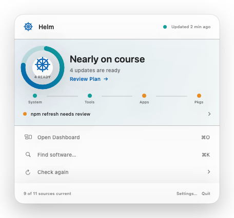

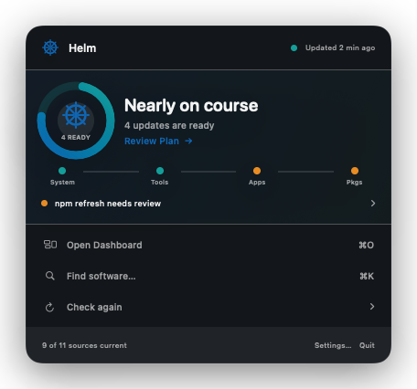

### Popover: Focused

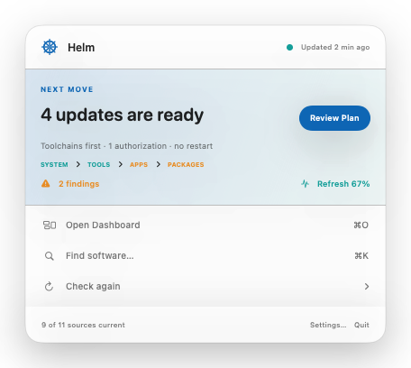

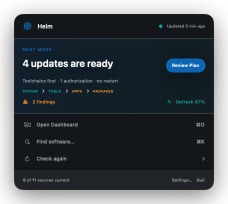

The Original popover remains the richest ambient summary. Quieter shifts toward a low-chrome status panel. Focused treats the popover as a next-action surface. All retain `Open Dashboard`, `Find software…`, and `Check again` as the only persistent operational commands; Settings/About/Quit remain quiet utilities.

## Course Indicator contract

The circular instrument in Original Wayfinder is the **Course Indicator**, a functional representation of Helm's highest-priority environment state. It is not decoration, a synthetic health score, or a percentage unless the active operation provides a trustworthy denominator.

| Mode | Ring behavior | Center content | Required adjacent explanation |
|---|---|---|---|
| Healthy/current | Complete Sea Glass course ring | Helm mark and `On course` | Freshness and coverage summary |
| Updates ready | Attention segment without implied percentage | Ready count | What is ready and `Review Plan` |
| Determinate work | True completed/total progress | Current authority stage or percentage | Current step, total progress, and Activity route |
| Indeterminate work | System-standard indeterminate course motion | Current stage symbol | What Helm is checking or waiting for |
| Approval required | Paused/open ring | Authorization symbol | Consequence and approval action |
| Failed/interrupted | Broken semantic-red ring | Failure symbol | Unchanged state, evidence, and recovery action |
| Cached/partial/offline | Muted or dashed incomplete ring | Cached/partial symbol | Freshness, missing coverage, and retry/defer behavior |

Dashboard and popover consume the same prioritized state projection. The Course Indicator never independently recomputes manager health or operation progress in SwiftUI. Text and symbols carry the meaning without color; VoiceOver exposes state, value when determinate, freshness, and the primary action. Indeterminate motion stops under Reduce Motion, increased contrast strengthens boundaries, and Reduce Transparency preserves legibility.

## Shared workflow direction

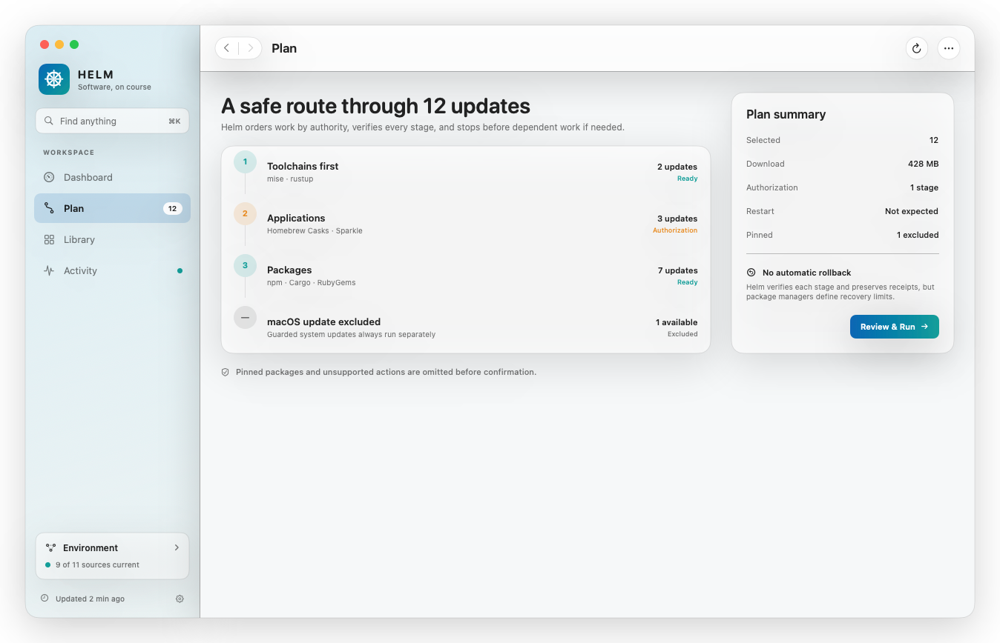

Plan remains a first-class safety object rather than an Updates table. It explains authority order, authorization, exclusions, restart expectations, verification, and recovery limits before confirmation.

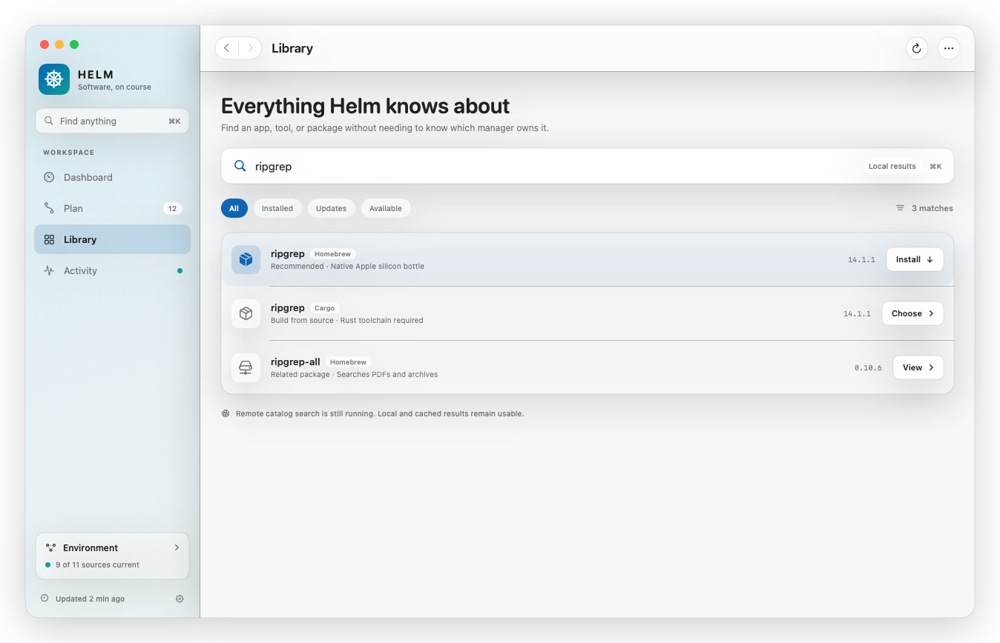

Library continues to begin with software intent rather than manager choice. Local and cached results appear immediately, while source rationale and remote enrichment are disclosed progressively.

## Earlier structural exploration

Briefing and Atlas remain recorded in Git history and the renderer as useful exploration, but they are no longer active candidates. Briefing demonstrated the value of plain-language hierarchy; Atlas demonstrated the value of visualizing environment ownership. Wayfinder absorbs those lessons without adopting their less scalable navigation models.

## Visual language

- **Native foundation:** system typography, native window controls, source-list behavior, toolbar semantics, selection, focus, and system-owned materials.
- **Recognizable Helm layer:** compass progress, route lines, connected environment stages, and a restrained horizon motif.
- **Color:** Helm Blue and Sea Glass communicate identity and progress. Semantic amber/red communicate attention/failure. Rope Gold remains reserved for genuine Pro or defined priority context.
- **Density:** spacious at the decision level; compact and tabular only where comparison requires it.
- **Motion:** route progress and state transitions only. No decorative ambient animation.
- **Progressive disclosure:** no permanent inspector on Dashboard. Detail appears after selection, in a contextual trailing pane or bounded presentation appropriate to the workflow.

## Common-job mapping

| Job | First route | Why it is simpler |
|---|---|---|
| Determine whether attention is needed | Popover or Dashboard hero | One truth and one next action; no metric interpretation |
| Review and run safe updates | Plan | Ordering and consequences are the primary structure |
| Find/install/manage software | Library or Command-K | Search by software first; source choice appears only when relevant |
| Understand/recover active work | Popover active state → Activity | Continuous context from execution through receipt/recovery |
| Understand manager/source state | Environment | Infrastructure remains discoverable without dominating daily work |
| Complete Project WOW first run | Dashboard hero + environment route | Environment Brief becomes the populated Dashboard rather than a disposable wizard result |

## Implementation handoff

1. Treat Original Wayfinder as the shell and visual foundation.
2. Implement the shared Dashboard/popover state projection before animating the Course Indicator.
3. Preserve native window, sidebar, command, focus, selection, appearance, and accessibility behavior ahead of pixel matching.
4. Validate minimum and expanded widths plus healthy, attention, approval, active, failure, cached/partial, and offline fixtures before broad migration.
5. Keep Quieter, Focused, Briefing, and Atlas as non-shipping comparison evidence, not additional themes or user-selectable layouts.

## Decision log

| Date | Proposal | Decision | Reason | Follow-up |
|---|---|---|---|---|
| 2026-08-07 | Round 1 A: Quiet Native | Preferred tone; rejected structure | Calm/native was strongest, but retained the current shell | Reset from first principles |
| 2026-08-07 | Round 1 B/C | Rejected | Skins over the same existing layout | Remove from active review |
| 2026-08-07 | Round 2.1: Navigator / Wayfinder | Positive direction | Two-surface, job-first structural rethink | Explore a few more compositions |
| 2026-08-07 | Round 2.2: Wayfinder / Briefing / Atlas | Wayfinder favored | Best balance of native familiarity, scale, and identity | Compare minor Wayfinder refinements |
| 2026-08-07 | Round 2.3: Original / Quieter / Focused | Original Wayfinder approved | Best overall balance; Course Indicator adds truthful dynamic value | Canonical contract alignment and incremental implementation |

If approved, the next proposal round will cover minimum-width Dashboard behavior, healthy/failure/partial/offline states, contextual detail presentation, Settings, and accessibility appearance variants before production styling begins.
