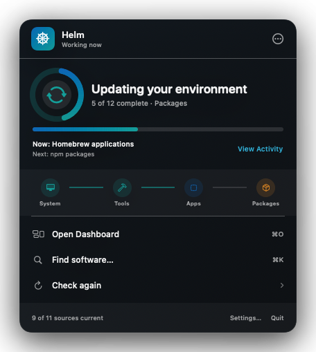
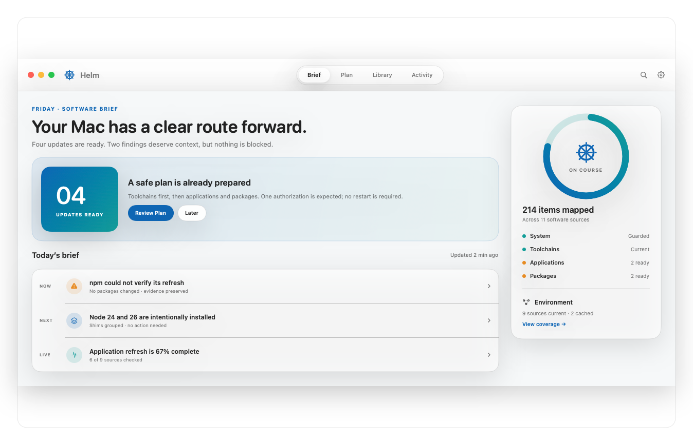
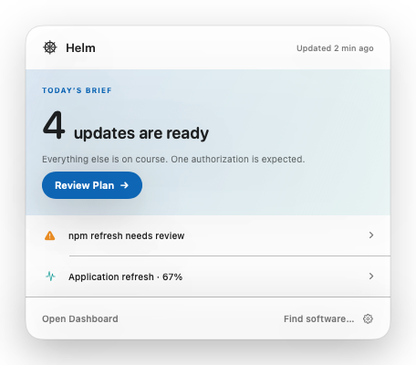
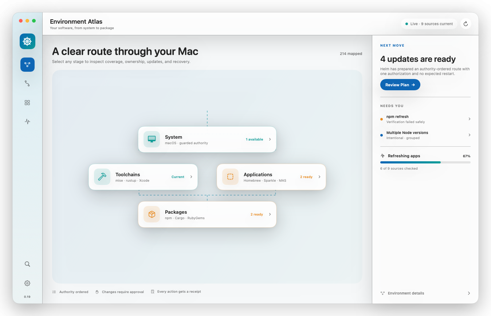
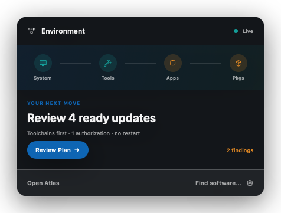

# v0.19 Experience Direction Proposal

Status: **Round 2, iteration 2 proposed; awaiting product-owner review**

Decision owner: project owner

Implementation effect: none until this experience direction is explicitly approved

## Why Round 1 was reset

The owner preferred Round 1 Direction A's calm native tone, but correctly found that all three directions were skins over substantially the same sidebar/content/inspector shell Helm already has. Round 1 is rejected as an experience direction.

Round 2 starts from Helm's purpose and six release-critical jobs rather than its current views. Iteration 1 established the Navigator thesis. Iteration 2 tests that thesis through three genuinely different compositions rather than three palettes competing over the same layout.

## Product thesis: Helm is an environment navigator

Helm should not feel like a package-manager dashboard or a grid of manager status cards. It should feel like a calm, trustworthy navigator for the Mac's whole software environment.

At every entry point, Helm should answer three questions in order:

1. **Am I on course?** State one dominant truth about the environment.
2. **What needs me?** Separate attention, approval, and active work from background detail.
3. **What is the safest next move?** Offer one clear action backed by Helm's authority ordering and verification model.

The product character is **quiet confidence**: professional and macOS-native, but recognizable through Helm's compass/route language rather than custom control chrome or a loud theme.

## What the references teach us

| Reference | Keep | Avoid |
|---|---|---|
| Docker Dashboard | Restraint, clear search, simple workspace navigation | Empty utility shell, oversized branded chrome, visually generic content |
| Avast | One dominant state, immediate recognition, confident composition | Promotional tile grid, visual theater, non-native controls, fear-driven messaging |
| macOS System Settings | Native translucent sidebar, platform spacing, familiar selection and toolbar behavior | High destination density and settings-like taxonomy for operational work |
| Docker menu | Fast command access, predictable menu semantics, direct Dashboard route | Too little product value and no meaningful active-work context |
| Parallels Toolbox | Dashboard/Library distinction and visual discoverability | Launcher grid, cartoon icon dependence, treating unlike actions as equal tiles |
| Current Helm popover | Real environment state, search route, visible active work | Miniature duplicate of the large window, metric-card density, deep management in a transient surface |

## Two operational interfaces

Helm has exactly two operational interfaces:

1. **Status-item popover** — ambient state, one next action, current work, and fast commands.
2. **Dashboard** — inspection, planning, discovery, execution, history, and recovery.

Left-click and right-click on the status item open the same popover. There is no separate context menu with a second information architecture. Standard macOS application menus, the Settings scene, confirmation sheets, and alerts remain system presentations rather than additional operational interfaces.

## Dashboard architecture

The large window is renamed **Dashboard**. Its default view is not a list with an always-open inspector. It is a responsive environment brief organized around current intent.

Primary workspace:

- **Dashboard** — dominant environment truth, route/coverage, items needing the user, and current work.
- **Plan** — dependency- and authority-ordered updates, exclusions, consequences, confirmation, and verification.
- **Library** — unified apps/tools/packages search and management without requiring manager knowledge first.
- **Activity** — active execution, approvals, history, Action Receipts, failure evidence, and recovery.

**Environment** is contextual infrastructure rather than a fifth peer workflow. It lives persistently at the sidebar foot and opens source/manager coverage, provenance, policy, and repair detail when needed.

This proposal intentionally reopens the currently approved Health/Updates/Packages/Activity/Sources IA. That contract remains authoritative until the owner approves this replacement and the source-of-truth IA is amended.

## Iteration 2: three Navigator compositions

All three families preserve the same product truth, safety model, terminology, and two-interface contract. They vary where attention begins, how navigation scales, and how prominently Helm visualizes the environment.

| Family | Composition | Strongest quality | Principal tradeoff |
|---|---|---|---|
| **Wayfinder** | Native sidebar + broad workspace + contextual content | Most balanced and scalable for frequent use | Closest to a conventional macOS utility shell |
| **Briefing** | Top workspace switcher + editorial daily brief + course card | Simplest reading order and most approachable check-in | Top navigation has less room as Helm grows |
| **Atlas** | Compact tool rail + spatial environment map + next-move panel | Most distinctive expression of Helm's cross-manager model | Less conventional; the map must remain useful in healthy/quiet states |

These are deliberately ingredient-compatible. For example, an approved direction could combine Wayfinder's labeled navigation, Briefing's editorial hierarchy, and Atlas's environment visualization without inheriting every detail from one family.

## Family A: Wayfinder

Wayfinder is the balanced iteration from the first Navigator proposal. It keeps a labeled native sidebar for long-term scalability while replacing Helm's old metric-led overview with an environment brief.

### Dashboard overview

The overview uses four layers:

1. A distinctive compass state states the single dominant truth and the next action.
2. The environment route makes Helm's unique system/toolchain/application/package model visible without exposing manager taxonomy.
3. `Needs you` contains only actionable or explanatory exceptions.
4. Current activity remains visible without turning the page into a task monitor.

Healthy state changes the hero to `Your environment is on course` and removes `Needs you`; it does not display zero-value cards. Failure and approval states replace the hero action while retaining the same geometry.

### Safe Plan workflow

Plan is a first-class safety object, not an Updates table. It explains execution order, authorization, exclusions, restart expectations, pins, verification, and recovery limits before final confirmation.

### Unified Library workflow

Library begins with the user's software intent, not a manager choice. Helm returns local and cached matches immediately, explains the recommended source, and progressively enriches remote results. Manager/source detail appears only when it affects a choice.

### Status-item popover

Wayfinder's popover is a deliberate hybrid:

- Avast-like dominant truth, but calm and factual.
- Docker-like native command rows and keyboard shortcuts.
- Helm-specific environment route and live task continuity.
- No manager snapshot, metrics grid, catalog results, nested settings overlay, or separate right-click menu.

The hero adapts among healthy, attention, approval, active, and failed states. The route is orientation, not a second dashboard. `Open Dashboard`, `Find software…`, and `Check again` are the only persistent operational commands; Settings/About/Quit remain quiet utility commands.

## Family B: Briefing

Briefing removes the sidebar and adopts a centered native workspace switcher. Its Dashboard reads like a concise daily report: one plain-language conclusion, one prepared next move, a chronological brief, and a persistent course card. Its popover uses the same editorial hierarchy in a more menu-like footprint.

Briefing maximizes immediate comprehension and perceived calm. Its risk is navigation scalability: destinations remain obvious at four items, but future peer workspaces would require stronger restraint or a different overflow model.

## Family C: Atlas

Atlas makes Helm's environment model the workspace itself. A compact tool rail preserves access to Plan, Library, and Activity; the main canvas shows authority and coverage from System through Toolchains and Applications to Packages; the trailing panel owns the single next move and active exceptions.

Atlas creates the strongest visual identity and clearest explanation of why Helm is more than a package-manager aggregator. Its risk is functional theater: the environment map must support selection, filtering, state comparison, and healthy-state value rather than becoming a decorative home screen.

## Working recommendation

Do not select based on the hero alone. The strongest likely synthesis is:

- Wayfinder's labeled navigation when discoverability and scale matter
- Briefing's plain-language conclusion and chronological `Today’s brief`
- Atlas's selectable environment model when ownership, authority, or coverage matters
- the more compact Briefing popover, with Atlas's route strip available only when it adds state

This synthesis is a hypothesis for review, not a fourth proposal. The goal of this iteration is to identify which structural ingredients feel unmistakably like Helm before converging.

## Visual language

- **Native foundation:** system typography, native window controls, source-list behavior, toolbar semantics, selection, focus, and system-owned materials.
- **Recognizable Helm layer:** compass progress, route lines, connected environment stages, and a restrained horizon motif.
- **Color:** Helm Blue and Sea Glass communicate identity and progress. Semantic amber/red communicate attention/failure. Rope Gold remains reserved for genuine Pro or defined priority context.
- **Density:** spacious at the decision level; compact and tabular only where comparison requires it.
- **Motion:** route progress and state transitions only. No decorative ambient animation.
- **Progressive disclosure:** no permanent inspector on Dashboard. Detail appears after selection, in a contextual trailing pane or bounded presentation appropriate to the workflow.

## Common-job mapping

| Job | First route | Why it is simpler |
|---|---|---|
| Determine whether attention is needed | Popover or Dashboard hero | One truth and one next action; no metric interpretation |
| Review and run safe updates | Plan | Ordering and consequences are the primary structure |
| Find/install/manage software | Library or Command-K | Search by software first; source choice appears only when relevant |
| Understand/recover active work | Popover active state → Activity | Continuous context from execution through receipt/recovery |
| Understand manager/source state | Environment | Infrastructure remains discoverable without dominating daily work |
| Complete Project WOW first run | Dashboard hero + environment route | Environment Brief becomes the populated Dashboard rather than a disposable wizard result |

## Review questions

1. Which family has the strongest overall composition: **Wayfinder**, **Briefing**, or **Atlas**?
2. Which individual ingredients should survive even if their family does not?
3. Do `Dashboard`, `Plan`, `Library`, and `Activity` match how you think about Helm's common jobs?
4. Should Environment be a persistent labeled destination, a visual workspace, or contextual infrastructure?
5. Which popover is closest to the right balance between meaningful state and menu-like speed?
6. Which element would you remove first from each preferred Dashboard or popover?

## Decision log

| Date | Proposal | Decision | Reason | Follow-up |
|---|---|---|---|---|
| 2026-08-07 | Round 1 A: Quiet Native | Preferred tone; rejected structure | Calm/native was strongest, but retained the current shell | Reset from first principles |
| 2026-08-07 | Round 1 B/C | Rejected | Skins over the same existing layout | Remove from active review |
| 2026-08-07 | Round 2.1: Navigator / Wayfinder | Positive direction | Two-surface, job-first structural rethink | Explore a few more compositions |
| Pending | Round 2.2: Wayfinder / Briefing / Atlas | Proposed | Compare navigation, reading order, and environment prominence | Owner review |

If approved, the next proposal round will cover minimum-width Dashboard behavior, healthy/failure/partial/offline states, contextual detail presentation, Settings, and accessibility appearance variants before production styling begins.
