# v0.20 Unified Wayfinder Popover Proposal

Status: **Implemented on `dev`; research validation remains open**

Scope: design decision, interaction contract, and implementation record for Roadmap Slice 20.1

The SwiftUI in `tools/design-lab/` remains a non-shipping, synthetic design record. The approved composition now also exists in the production `WayfinderPopoverView`, backed by Helm's shared Wayfinder projection and deep-link contracts. The design-lab renderer is not production code and is not evidence that the shipping view passed runtime validation.

## Owner decision

On 2026-08-16, the owner approved the proposed composition and requested that it remain intact with these refinements:

1. Increase the smallest route and context copy slightly.
2. Make the route strip visually quieter than the Course hero.
3. Improve the healthy hero's balance without inventing an action.
4. Keep the utilities menu discoverable while subordinate to operational actions.

The updated renders implement that decision without changing the 400-by-458-point composition, region order, or action hierarchy. The healthy hero now uses a quiet noninteractive reassurance, and the utilities control has a bounded button treatment with an explicit accessibility label and hint.

Original Wayfinder remains the approved visual direction. This proposal does not reopen that decision. It applies the approved environment-navigator thesis to the production popover gap left after v0.19:

1. State one dominant truth.
2. Explain why it matters.
3. Offer one safest next action when action is needed.
4. Preserve compact route orientation and three fast commands.
5. Move inspection, selection, output, and recovery depth into the relevant Dashboard workspace.

## Resolved production gap

The v0.19 production popover behaved like a miniature Dashboard. It contained an inline search field, three metric chips, a manager snapshot, expandable task rows, and custom search/About/Quit overlays. That density conflicted with the approved surface contract and created avoidable layout churn as service state changed.

The v0.20 implementation removes those regions rather than restyling them. Dashboard, Plan, Library, Activity, and Environment now own their respective depth, while the popover retains one condition, one optional next action, compact environment orientation, and three fast commands.

## Proposed structure

The panel uses one 400-by-458-point content frame for every ordinary state:

| Region | Responsibility |
|---|---|
| Header | Helm identity, freshness, and a quiet utility menu |
| Course hero | Highest-priority condition, accessible explanation, and at most one contextual action |
| Environment route | System, Tools, Apps, and Packages orientation without manager-level detail |
| Context row | One useful secondary fact, never a metric grid |
| Commands | Open Dashboard, Find software, and Check again |

The utility menu behind the ellipsis contains Settings, Check for Helm Updates, Support & Feedback, About Helm, and Quit Helm. These remain available without competing with the operational hierarchy.

Healthy has no hero button because Helm has no action to demand. `Open Dashboard` remains available in the stable command area. Offline disables `Check again` and uses `View Saved State` to explain what remains available.

## Representative states

### Healthy

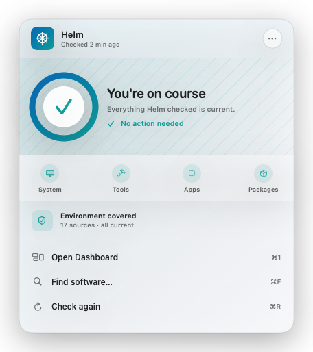

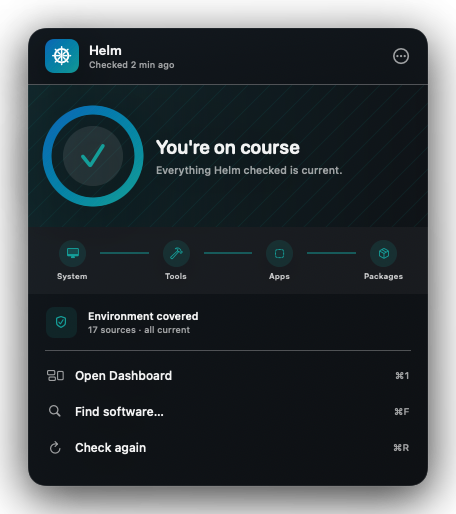

### Updates Ready

Updates use Sea Glass rather than Needs Review amber. The four Course Indicator segments communicate a ready count without presenting a completion percentage.

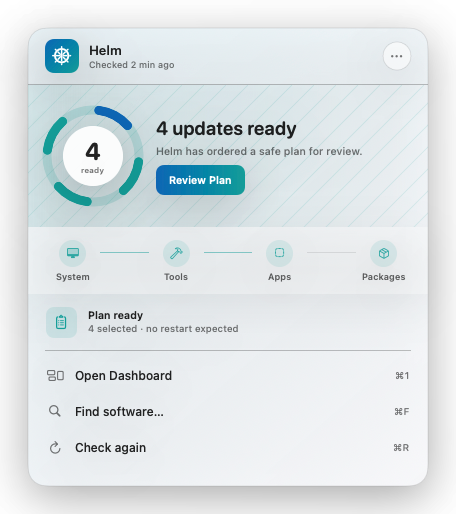

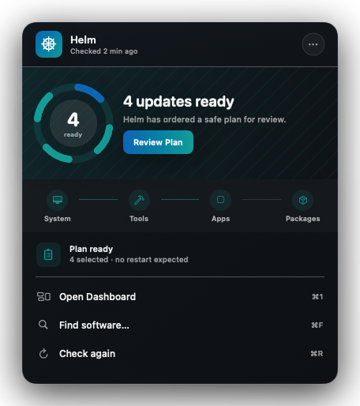

### Running

Determinate progress appears only when the shared projection supplies a valid completed/total value. Indeterminate work uses the same footprint with a nonnumeric Course Indicator.

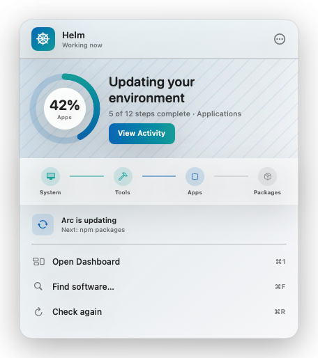

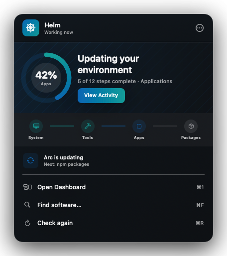

### Needs Review

The route identifies the affected environment domain, while the context row names the actual finding. The user should not have to inspect managers one at a time to discover why Helm needs review.

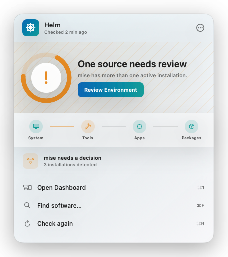

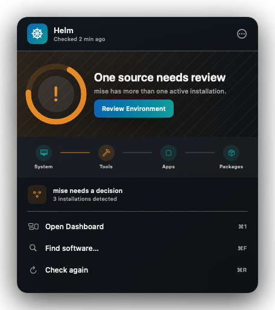

### Error or interrupted work

Completed route segments keep their successful meaning. Red begins where work was interrupted, and recovery copy does not claim an unverified result.

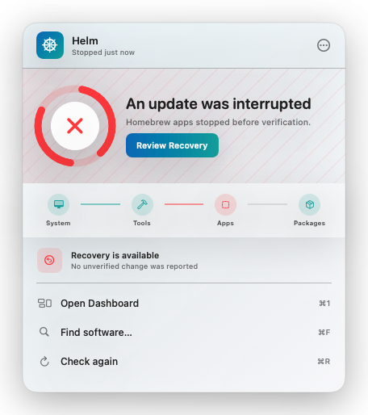

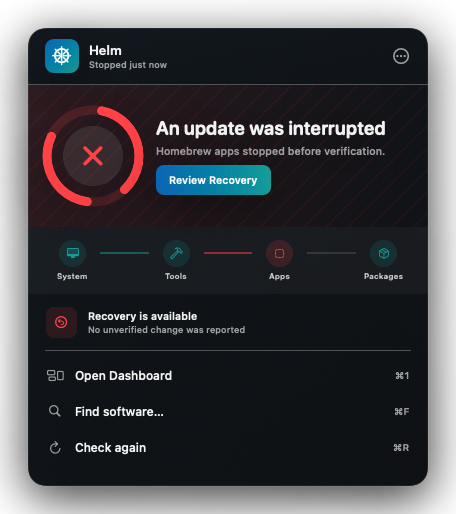

### Offline or cached state

Offline is neutral rather than failed. Local Library, Plan, and history remain available, while network work is explicitly deferred.

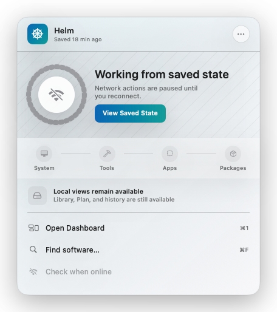

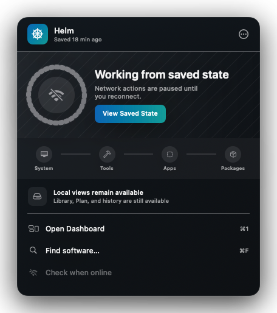

## Routing contract

| Popover element | Dashboard destination |
|---|---|
| Review Plan | Plan with the current reviewed plan selected |
| View Activity | Activity with the active workflow selected |
| Review Environment | Environment with the actionable manager/source selected |
| Review Recovery | Activity with the interrupted workflow and recovery context selected |
| View Saved State | Dashboard focused on freshness and deferred work |
| Open Dashboard | Dashboard primary content without changing active workflow state |
| Find software | Library with toolbar search focused |
| Route stage | Environment filtered to the represented domain; an affected manager is also selected when known, and no manager mini-list opens in the panel |

Deep links must preserve stable entity/workflow IDs, originating condition, focus target, and route domain when initiated from a route stage. Opening or closing the panel must not submit work, reset selection, or cancel a workflow.

## What leaves the popover

| v0.19 popover behavior | v0.20 destination |
|---|---|
| Inline package search and result actions | Library search and contextual detail |
| Pending/failure/running metric chips | Course priority plus Dashboard/Plan/Activity badges |
| Manager snapshot rows | Environment |
| Expandable command/output task rows | Activity detail |
| Upgrade-plan sheet hosted by the popover | Plan plus one bounded final confirmation |
| Search/About/Quit full-panel overlays | Dashboard search and native utility menu/standard presentation |

No package mutation, manager configuration, long diagnostics, or output browsing occurs inside the transient panel.

## Stability and platform behavior

- Ordinary states retain the same panel footprint; text expansion may grow within a bounded maximum rather than resizing on every snapshot revision.
- Cached content renders immediately. Reconnect banners do not replace the whole hierarchy or oscillate panel height.
- Primary and secondary status-item activation keep the v0.19 Dashboard-aware behavior.
- The panel remains dismissible by outside click and Escape without affecting work.
- Screen-edge placement, multiple displays, full-screen Spaces, focus return, and inactive appearance remain implementation gates.
- The panel may use the existing constrained `NSPanel` only if it continues to pass those gates; this proposal does not pre-decide `NSPopover` versus `NSPanel` by appearance alone.

## Accessibility and localization contract

- The Course Indicator is one accessibility element with condition, freshness, determinate value when valid, explanation, and action.
- Color is never the only state cue; symbols, labels, route state, and copy remain semantic.
- VoiceOver order follows header, Course hero, route summary, context, commands, then utility menu.
- Full Keyboard Access traverses only actionable elements; decorative route marks and healthy summary text are not stops.
- Reduce Motion replaces indeterminate animation with a static system-equivalent state.
- Increase Contrast strengthens ring, connector, text, and focus boundaries.
- Reduce Transparency substitutes opaque semantic surfaces without changing hierarchy.
- All seven locales and representative +40% text expansion must pass before production replacement.

## Implementation checkpoint

The composition and production-replacement gates are resolved:

1. The production view preserves the approved 400-by-458-point composition, information density, Course Indicator semantics, quiet route strip, single context row, contextual action, and utility menu.
2. Shared projection truth drives Healthy, Updates Ready, Running, Needs Review, Error, offline, refreshing, approval, and service-unavailable states without moving business rules into SwiftUI.
3. Deep links preserve originating condition, destination, focus, domain, and affected manager when known. The post-implementation correction verified that System, Tools, Apps, and Packages visibly filter Environment rather than opening one undifferentiated view.
4. The legacy search, metric, manager, task, overlay, upgrade-sheet, and dynamic-size regions have been removed from the production popover.
5. Focused tests cover projection priority, semantic route tone, finding context, deep-link preservation, offline refresh availability, and the fixed ordinary footprint.

The remaining gate is validation, not another visual replacement. A debug-only `HELM_WAYFINDER_POPOVER_FIXTURE` seam renders all six approved representative states through the production presenter and suppresses refresh/update-check submission while active. The owner state/accessibility matrix is complete and the canonical whole-workflow corpus is seeded; production destination projection and the moderated participant checkpoint remain open. See `docs/validation/v0.20-wayfinder-popover-research-readiness.md`.
