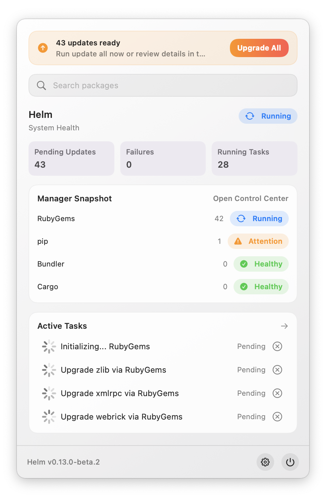
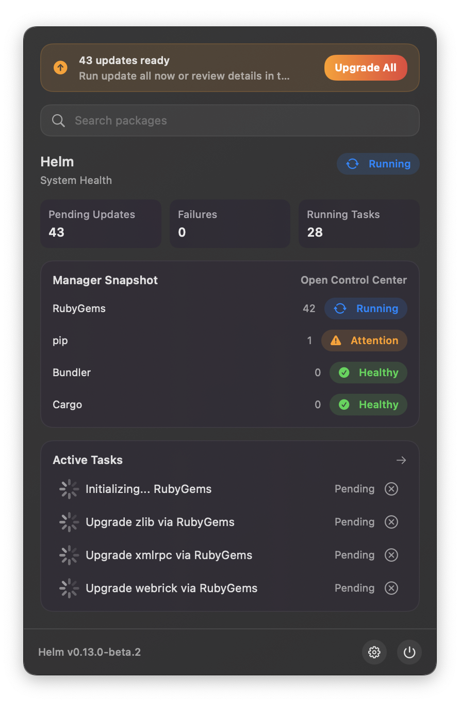
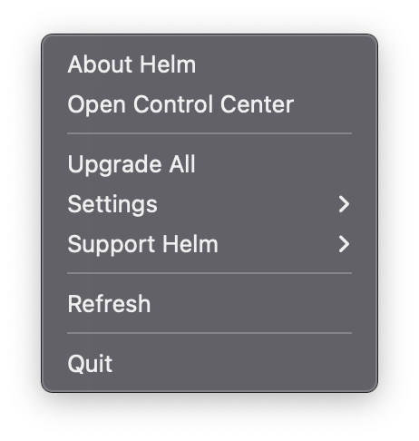
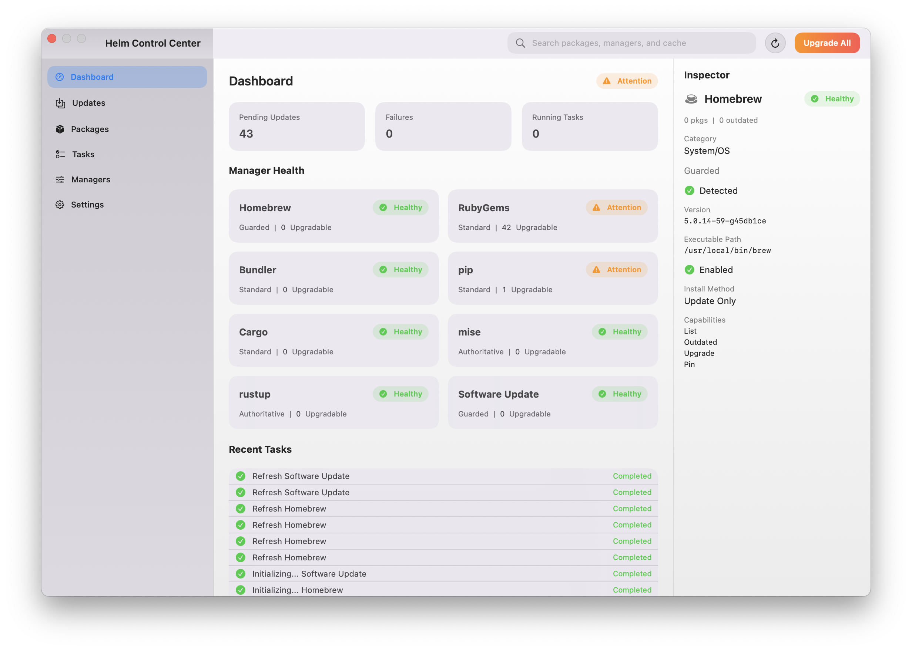
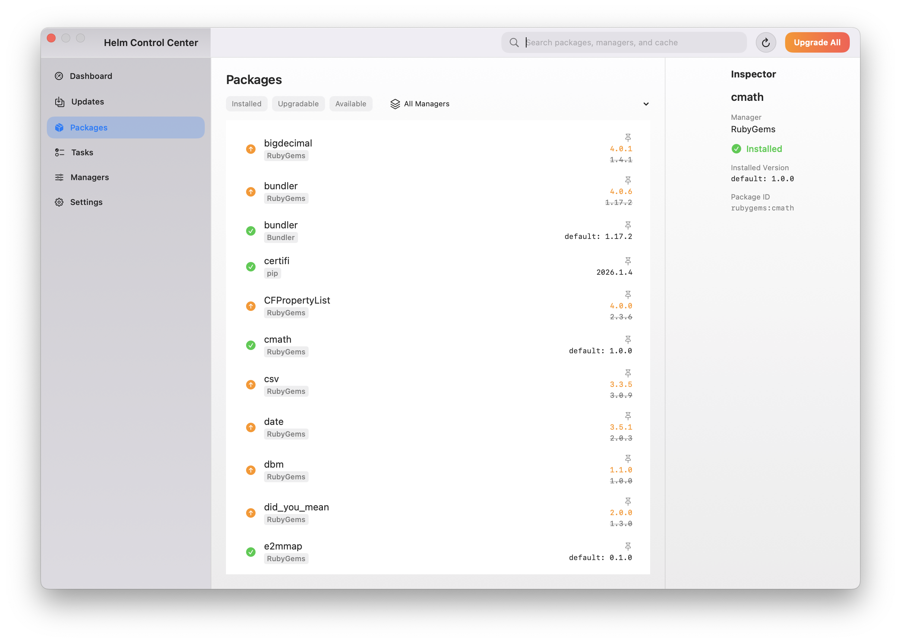
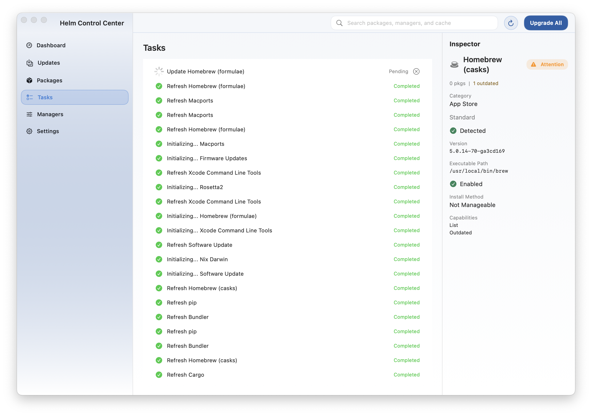
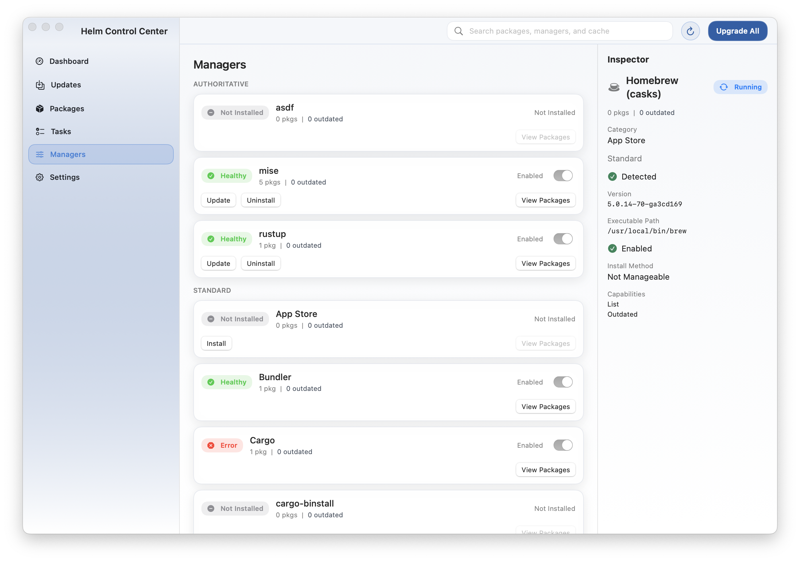
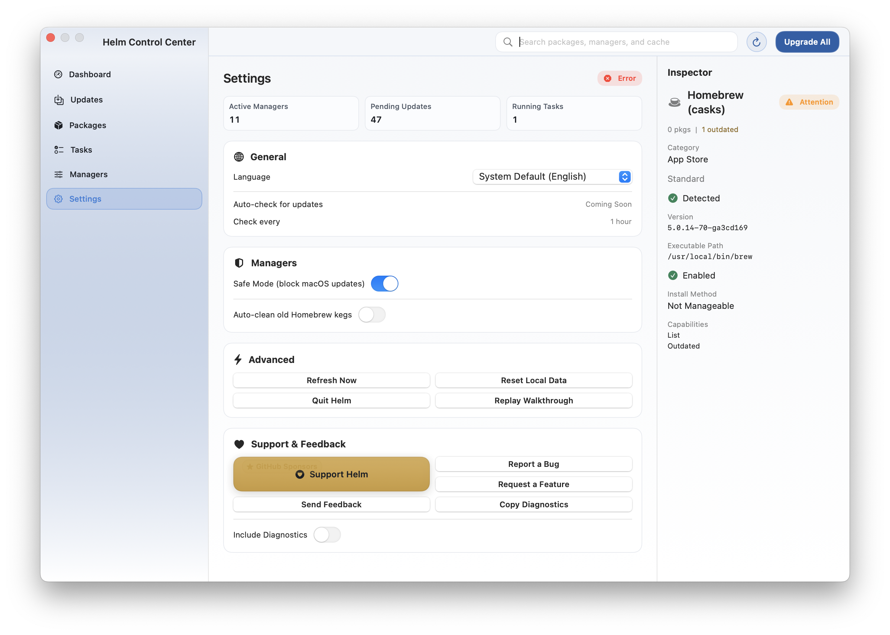
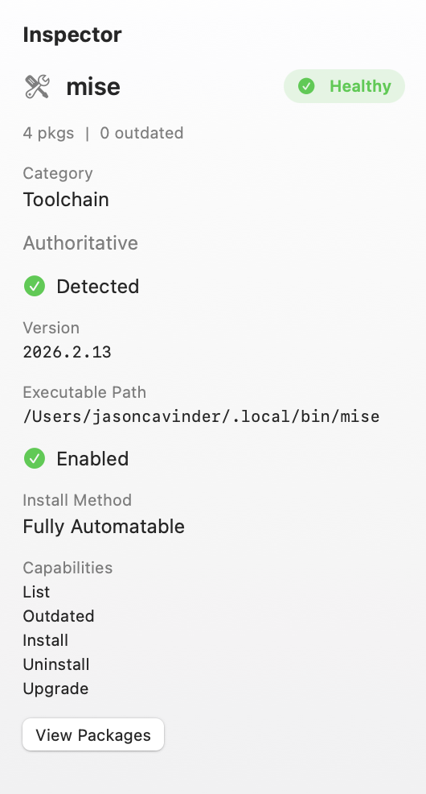
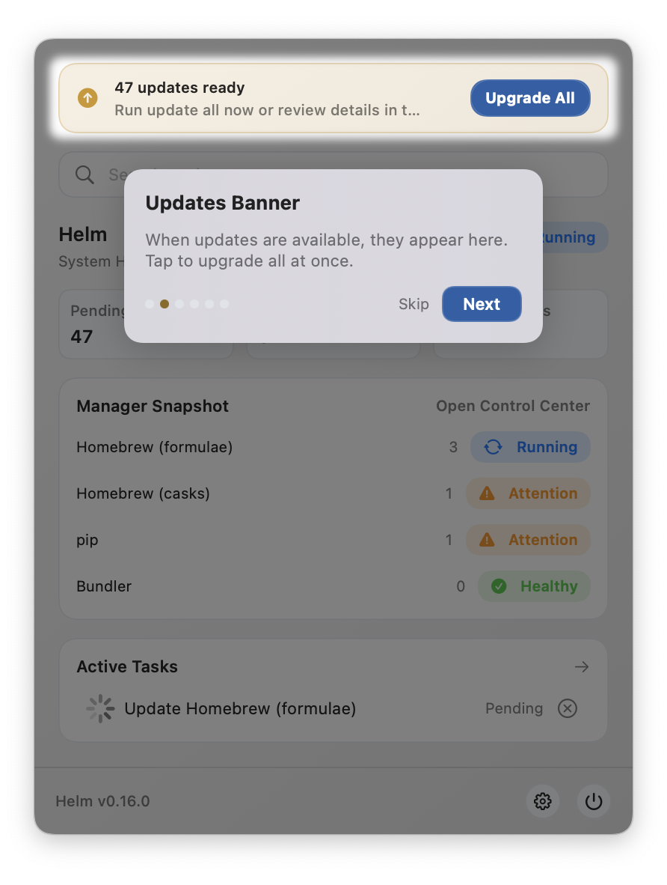

import { Aside } from '@astrojs/starlight/components';

Helm has two main surfaces: a **menu bar popover** for quick triage and a **Control Center window** for deeper management. This tour walks through each.

<Aside type="note">
Screenshots show Helm v0.13.0-rc.2 on macOS. The interface may vary slightly between versions.
</Aside>

---

## Menu Bar Popover

Click the Helm icon in the menu bar to open the popover. It shows your environment health at a glance: update counts, active tasks, and quick actions.

The popover adapts to dark mode automatically.

---

## Status Menu

Right-click the Helm icon for quick actions: About, Control Center, Upgrade All, Settings, Support Helm, Refresh, and Quit.

---

## Control Center — Overview

The Control Center is a standalone window with sidebar navigation. The **Overview** tab shows health posture, package statistics, the manager grid, and recent task activity.

---

## Control Center — Packages

Browse installed, upgradable, and available packages. Filter by status or manager. Click any package to see details in the inspector sidebar.

---

## Control Center — Tasks

Track all background operations in real time. Tasks show lifecycle states: Queued, Running, Completed, Failed, or Canceled.

---

## Control Center — Managers

View per-manager health, detection status, and capabilities. Managers show health badges (Healthy, Attention, Error, Not Installed).

---

## Control Center — Settings

Configure cadence, policy, localization, and accessibility. The **Support & Feedback** card provides direct links to report bugs, request features, and share diagnostics.

---

## Inspector Sidebar

Select any task, package, or manager in the Control Center to open the inspector sidebar. It shows contextual detail: version info, pin state, manager attribution, health badges, and available actions.

---

## Onboarding Walkthrough

On first launch, Helm offers a guided walkthrough using spotlight overlays that highlight key UI elements with step-by-step explanations. You can replay it anytime from Settings.

